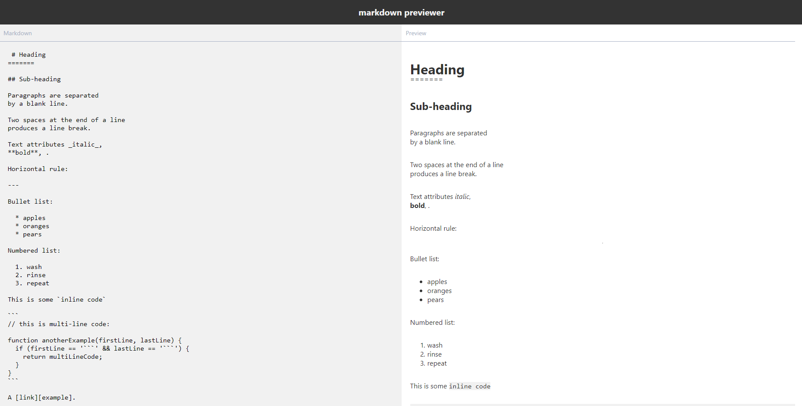

# React Markdown Previewer
A markdown previewer built with ⚛ React ⚛ and [marked.js](https://marked.js.org) as part of the FreeCodeCamp Front-end certification. The specification page can be found here: [freecodecamp markdown previewer](https://learn.freecodecamp.org/front-end-libraries/front-end-libraries-projects/build-a-markdown-previewer).

---

## Installation

Clone the repo `git clone https://github.com/MattLdwig/react-markdown-preview.git`

Install dependencies `npm install`

Start with `npm start` and open `localhost:3000` to view it in the browser.

---

## How it works

Simply type markdown in the left part to see the result in the right part. The compilation is done in real time.

### Placeholder 

Placeholders (text and image) comes from [Wikipedia](https://en.wikipedia.org/) .

### License

This application is [licensed as MIT](License.md). 

